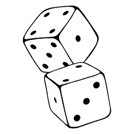

Jeu de Dés (2 Joueurs)

Un petit jeu de dés en JavaScript où le premier joueur à atteindre 100 points remporte la partie. Ce projet utilise HTML, CSS, Bootstrap et JavaScript Vanilla (ES6+).
📸 Aperçu

##🚀 Fonctionnalités

    🎯 Deux joueurs.

    🎲 Bouton "Lancer le dé" : génère un nombre aléatoire entre 1 et 6.

    🖐️ Bouton "Hold" : permet de garder le score actuel et de passer la main.

    🔄 Bouton "Nouvelle Partie" : réinitialise tous les scores et recommence la partie.

    👑 Le premier joueur qui atteint 100 points gagne.

    🎨 Interface responsive avec Bootstrap 5.

🛠️ Technologies Utilisées

    HTML5 — Structure.

    CSS3 — Style et mise en page.

    Bootstrap 5.2 — Design responsive et classes utilitaires.

    JavaScript Vanilla (ES6) — Logique du jeu (sans framework JS).

##📂 Structure du projet

/project-root/
│
├── index.html
├── /style/
│   └── style.css
├── /js/
│   └── main.js
├── /img/
│   ├── dice-1.png
│   ├── dice-2.png
│   ├── dice-3.png
│   ├── dice-4.png
│   ├── dice-5.png
│   ├── dice-6.png
│   └── logo_page.png
└── README.md

##⚙️ Comment exécuter le projet

    Clone ce dépôt ou télécharge le .zip.

    Assure-toi que tous les fichiers images des dés (dice-1.png à dice-6.png) sont bien dans le dossier /img/.

    Ouvre index.html dans ton navigateur.

    Joue !

##🎉 Objectifs pédagogiques

Ce projet te permet de pratiquer :

    La manipulation du DOM en JavaScript.

    La gestion d'événements (addEventListener).

    La logique de jeu : conditions, alternance de joueurs, gestion d’état.

    Un design simple mais responsive avec Bootstrap 5.

    L'organisation de fichiers dans un projet Front-end.

##🔥 Idées d’améliorations (Roadmap)

    Ajouter des animations de lancer de dé (CSS/JS).

    Permettre de changer les noms des joueurs.

    Créer une version mobile friendly avec plus d’effets visuels.

    Sauvegarder le score dans le localStorage.

    Ajouter des règles avancées (ex : perdre tout son score si on fait deux fois 1 de suite).
## 🚀 Lien du Projet
🔗 Voire le line du projet [cliquez ici](https://hindsarra.github.io/Dynamiser-vos-sites-web-avec-Javascript/)

##

##📜 Licence

Projet libre d’apprentissage — Tu peux le modifier et le réutiliser ! ✌️
